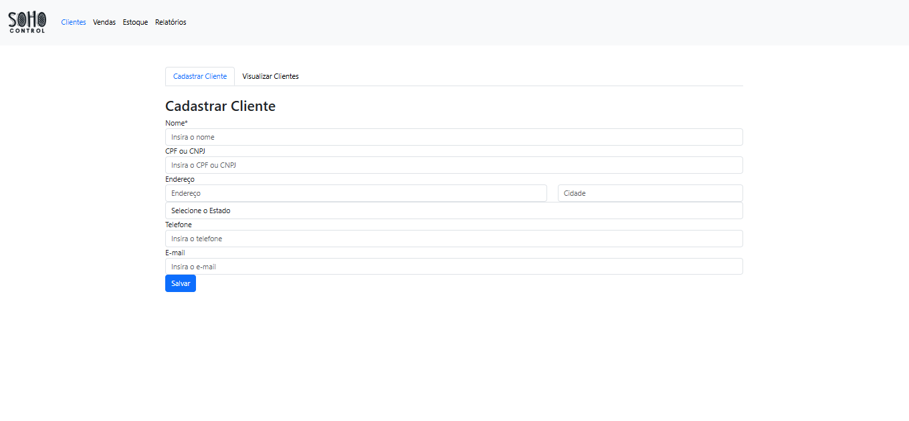
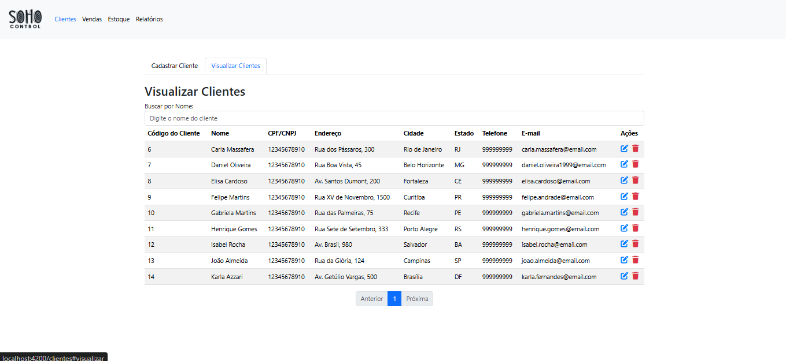
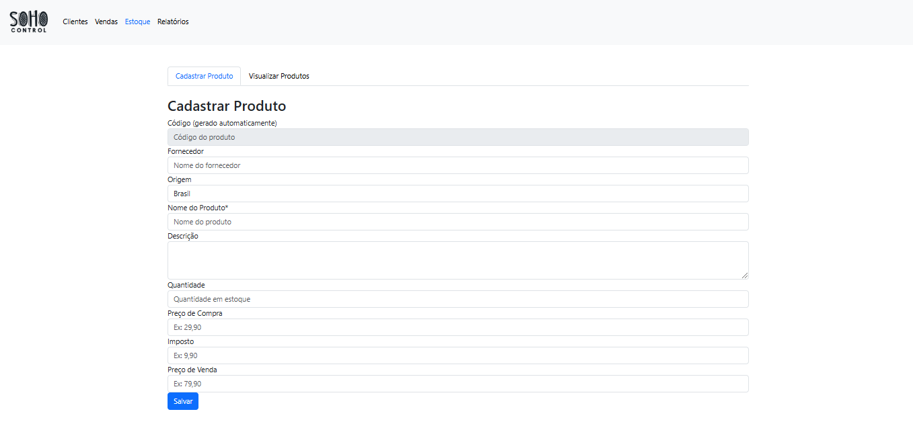
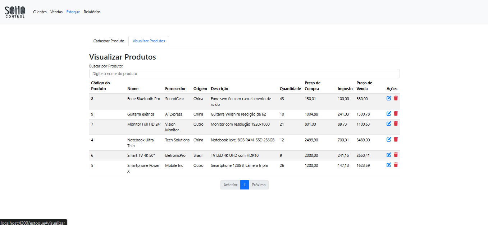
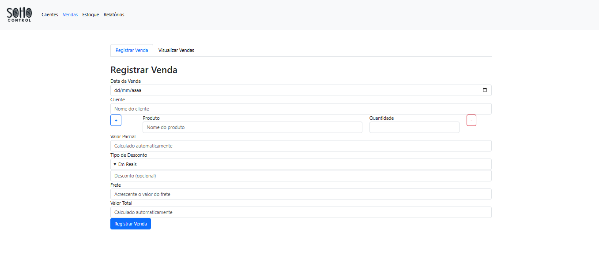
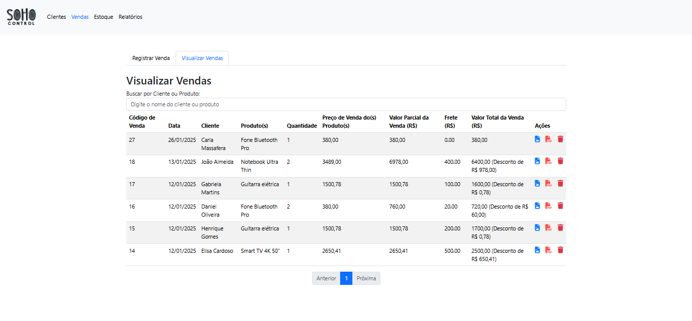
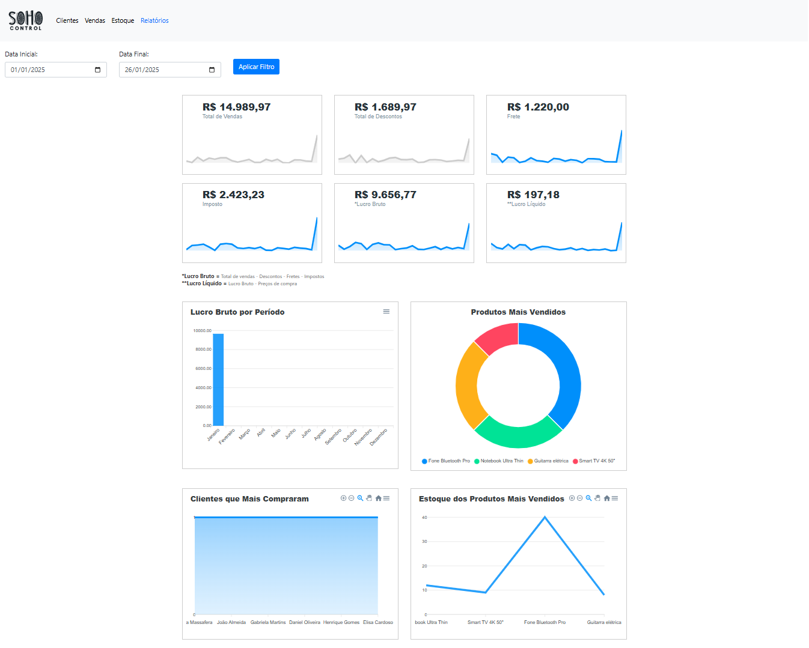

# Soho Control

## Descrição do Projeto

**Soho Control** é um sistema de gerenciamento original criado por mim, que permite realizar controle de clientes, estoque, vendas e relatórios de forma prática e eficiente. O sistema é voltado para pequenos e médios negócios que buscam organizar suas operações e aumentar a produtividade.

Com Soho Control, é possível:
- Gerenciar informações de clientes.
- Registrar e visualizar vendas.
- Controlar o estoque de produtos.
- Acompanhar dados e gerar relatórios financeiros.

O sistema é totalmente modular, dividido em quatro áreas principais: **Clientes**, **Vendas**, **Estoque** e **Relatórios**.

---

## Funcionalidades

### **1. Gestão de Clientes**
- Cadastro completo de clientes, incluindo:
  - Nome, CPF/CNPJ, Endereço, Cidade, Estado, Telefone e E-mail.
- Edição e exclusão de informações de clientes.
- Busca de clientes por nome.
- Paginação de clientes para exibição eficiente.




### **2. Controle de Estoque**
- Cadastro de produtos com informações como:
  - Código, Fornecedor, Origem, Nome do Produto, Descrição, Quantidade, Preço de Compra, Imposto e Preço de Venda.
- Edição e exclusão de produtos.
- Busca de produtos por nome.
- Paginação de produtos para exibição organizada.




### **3. Registro de Vendas**
- Registro de vendas, incluindo:
  - Data da venda, cliente, produtos vendidos, quantidades, descontos e frete.
- Cálculo automático de valores:
  - Valor parcial, desconto, frete e valor total.
- Edição e exclusão de vendas.
- Busca de vendas por cliente ou produto.
- Visualização de vendas com paginação.
- Geração de PDF e PNG com descritivo da venda





### **4. Relatórios**
- Gráficos e estatísticas detalhados, incluindo:
  - Total de vendas.
  - Total de descontos aplicados.
  - Frete
  - Impostos
  - Lucro bruto e líquido.
  - Produtos mais vendidos.
  - Clientes que mais compraram.
  - Estoque dos produtos mais vendidos.
- Filtros por período (data inicial e final).



---

## Estrutura do Projeto

O sistema é dividido em várias camadas, cada uma desempenhando um papel específico:

### Frontend
O frontend é desenvolvido utilizando **HTML5**, **CSS3** e **JavaScript**, com suporte da biblioteca **Bootstrap** para estilização e responsividade. As principais funcionalidades incluem:

- Formulários para cadastro de clientes, produtos e vendas.
- Interface amigável e organizada com abas para navegação.
- Gráficos dinâmicos utilizando a biblioteca **ApexCharts**.

### Backend
O backend é desenvolvido em **Java Spring Boot** e expõe APIs REST para manipulação de dados. Principais funcionalidades:

- **Clientes**: Endpoints para CRUD de clientes.
- **Produtos**: Endpoints para CRUD de produtos.
- **Vendas**: Endpoints para registrar, listar e excluir vendas.
- **Relatórios**: Endpoint para gerar dados baseados em filtros.

### Banco de Dados
O sistema utiliza um banco de dados relacional, como **MySQL**, para armazenar as informações. As tabelas principais incluem:
- `Clientes`
- `Produtos`
- `Vendas`
- `ItensVenda`

---

## Tecnologias Utilizadas

- **Frontend**:
  - HTML5, CSS3, JavaScript.
  - Bootstrap.
  - ApexCharts.

- **Backend**:
  - Java 17.
  - Spring Boot.
  - REST APIs.

- **Banco de Dados**:
  - MySQL.

- **Outros**:
  - jQuery (para interatividade no frontend).

---

## Instalação e Configuração

### Pré-requisitos
Certifique-se de ter os seguintes softwares instalados:
- **Java 17** ou superior.
- **Maven** para gerenciar dependências.
- **MySQL** como banco de dados.
- **Node.js** (opcional, para gerenciar dependências do frontend).

### Passos para Configuração

1. **Clone o Repositório**:
   ```bash
   git clone https://github.com/coderpedrosilva/sohocontrol
   cd sohocontrol
   ```

2. **Configuração do Banco de Dados**:
   - Crie um banco de dados chamado `soho_control`.
   - Atualize as credenciais no arquivo `application.properties`:
   ```properties
   spring.application.name=sohocontrol 
   spring.datasource.url=jdbc:mysql://localhost:3306/soho_control
   spring.datasource.username=SEU_USUARIO
   spring.datasource.password=SUA_SENHA
   spring.datasource.driver-class-name=com.mysql.cj.jdbc.Driver
   
   spring.jpa.hibernate.ddl-auto=update
   spring.jpa.show-sql=true
   spring.jpa.properties.hibernate.dialect=org.hibernate.dialect.MySQL8Dialect
   ```

3. **Compile o Projeto (Backend)**:
   ```bash
   cd sohocontrol_springboot
   mvn clean install
   ```

4. **Execute o Backend**:
   ```bash
   mvn spring-boot:run
   ```

5. **Configuração e Execução do Frontend**:
   - Navegue até a pasta do frontend:
   ```bash
   cd ../sohocontrol_spa
   ```

   - Instale as dependências do projeto:
   ```bash
   npm install
   ```

   - Execute o servidor do frontend:
   ```bash
   node server.js
   ```

6. **Acesse o Sistema**:
   - O **Frontend** estará disponível em `http://localhost:4200`.
   - O **Backend** estará disponível em `http://localhost:8080`.

---

## Como Contribuir

1. Faça um fork do repositório.
2. Crie uma branch para sua feature:
   ```bash
   git checkout -b minha-feature
   ```
3. Faça commit das suas alterações:
   ```bash
   git commit -m "Descrição da alteração"
   ```
4. Envie para sua branch:
   ```bash
   git push origin minha-feature
   ```
5. Abra um Pull Request no repositório original.

---

## Licença

Este projeto é licenciado sob a **Apache License 2.0**, permitindo uso, modificação, distribuição e venda do software. Atribuição ao autor original é obrigatória, e a licença inclui proteção contra disputas de patentes.

Para mais detalhes, veja o arquivo [LICENSE](LICENSE) ou visite [Apache License 2.0](https://www.apache.org/licenses/LICENSE-2.0).

---

# Instalação do Express

### 1. Instalação do Express.js do Zero

Se você está começando do zero e deseja configurar o Express.js, siga as instruções abaixo.

**Passo 1:** Criar um Novo Projeto Node.js

Navegue até o diretório onde deseja criar o projeto:
```bash
cd caminho/onde/deseja/criar/o/projeto
```

Inicialize um novo projeto Node.js:
```bash
npm init -y
```

Instale o Express.js:
```bash
npm install express
```

**Passo 2:** Criar o Servidor Express

No diretório do projeto, crie um arquivo chamado `server.js` e adicione o conteúdo necessário (conforme consta no projeto).

Execute o servidor Express:
```bash
node server.js
```

Acesse o servidor pelo navegador em `http://localhost:4200`.

Se houver problemas de execução no PowerShell, você pode ajustar a política de execução com:
```bash
Set-ExecutionPolicy RemoteSigned -Scope CurrentUser
```

---

### 2. Reinstalação das Dependências do Projeto com Express.js

Caso você já tenha o projeto clonado, mas precise reinstalar as dependências que não foram incluídas no repositório devido ao `.gitignore`, siga estas etapas.

**Passo 1:** Navegue até o Diretório do Projeto

Navegue até o diretório onde o projeto foi clonado:
```bash
cd caminho/até/o/projeto
```

**Passo 2:** Baixar e Reinstalar as Dependências

Baixe a pasta `node_modules` e reinstale todas as dependências listadas no `package.json` com o seguinte comando:
```bash
npm install
```

**Passo 3:** Verificar o Arquivo `server.js`

Certifique-se de que o arquivo `server.js` está presente no diretório do projeto.

**Passo 4:** Executar o Servidor Express

No diretório do projeto, execute o servidor Express:
```bash
node server.js
```

Acesse o servidor pelo navegador em `http://localhost:4200`.

---

### 3. Para Usar o Nodemon

Você pode usar o Nodemon para substituir o comando `node server.js`. O Nodemon reinicia automaticamente o servidor sempre que houver alterações no código, tornando o desenvolvimento mais prático.

Para usar o Nodemon:

1. Instale o Nodemon globalmente:
```bash
npm install -g nodemon
```

2. Depois, no diretório do projeto, use o seguinte comando para iniciar o servidor:
```bash
nodemon server.js
```

Dessa forma, o servidor será automaticamente reiniciado sempre que você modificar o código em `server.js`.
